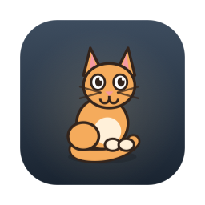
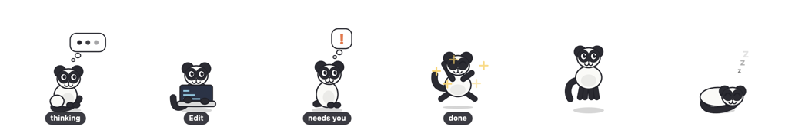

<div align="center">



# Pet Project

**A desktop pet for macOS that reacts to your coding agent.**

It types at a tiny laptop while a tool runs, thinks between steps, raises a `!`
when the agent needs you, and celebrates when a turn finishes. The rest of the
time it wanders, grooms itself and falls asleep.

Works with **Claude Code**, **Codex**, **Gemini CLI** and **opencode**.



</div>

## Install

```sh
git clone https://github.com/ryccoatika/PetProject.git
cd PetProject/MacApp
./build.sh                # builds, installs to ~/Applications, runs it
```

Then, to make it react to your agent:

```sh
pet plugin install        # every agent found on this machine
```

If a [release](https://github.com/ryccoatika/PetProject/releases) is available
you can instead download the disk image, drag **Pet.app** into Applications and
open it — it installs the `pet` command on first launch. The app is signed
ad-hoc rather than notarised, so macOS asks you to confirm the first time:
right-click → Open. Building it yourself avoids that.

Requires macOS 12 or later, Intel or Apple Silicon. No dependencies — not
Homebrew, not Python, not a package manager.

## What it does

- **Reacts to your agent.** Seven lifecycle events map to poses, so a glance
  tells you whether it is running a tool, thinking, stuck on a permission
  prompt, or done.
- **Drawn or spritesheet.** Four hand-drawn skins are built in, and any pack
  from [codex-pets.net](https://codex-pets.net) can be installed from the menu.
- **Yours to shape.** Skins are plain JSON. Drag the pet anywhere, resize it
  from 50% to 200%, hide it, or hide the menu bar icon and drive it from the
  terminal.
- **Cheap.** About 1.4% of a core while idle, 0.1% hidden — the loop slows down
  when nothing is moving.

```sh
pet status          # what it is doing right now
pet skin dog        # switch skin
pet size 150        # make it bigger
pet help            # everything else
```

## Documentation

| | |
|---|---|
| [Architecture](docs/ARCHITECTURE.md) | how it works, end to end |
| [CLI reference](docs/CLI.md) | every command |
| [Skins](docs/SKINS.md) | the `.petskin` format and sprite packs |
| [Agent plugins](docs/PLUGINS.md) | how each agent drives the pet |
| [Contributing](CONTRIBUTING.md) | building, testing, sending a change |
| [Releasing](docs/RELEASING.md) | for maintainers |
| [Changelog](CHANGELOG.md) | what changed, by version |

## Project layout

```
MacApp/     the macOS app and the `pet` command
docs/       documentation
```

A mobile version is planned; skin files are designed to be shared between
platforms.

## Licence

[MIT](LICENSE) — do what you like, keep the copyright notice.
