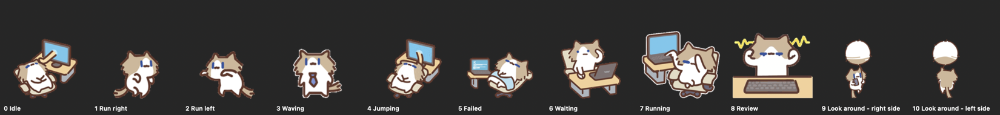

# Skins

## Sprite packs

Besides the drawn skins, the pet can be a spritesheet character from
[codex-pets.net](https://codex-pets.net):

    pet pets install perlica-endfield     download from the marketplace
    pet pets install https://codex-pets.net/#/pets/gugakurumiusa
    pet pets install ~/Downloads/foo.codex-pet   a local folder or .zip
    pet pets                              list what is installed
    pet pets remove <id>
    pet skin <id>                         switch to it (same command as skins)

Packs land in `~/.config/pet/pets/<id>/` and appear in the menu and in
`pet skins` alongside the drawn skins.

From the menu bar it is 🐈 → Skin → **Install Pet from codex-pets.net…**, which
asks for a link or an id — a pasted `codex-pets.net` link on the clipboard is
filled in for you. **Browse codex-pets.net** opens the gallery. Downloading
happens in the background, so the pet keeps animating, and the new pet is
selected as soon as it lands. Option-click an installed pet in that menu to
remove it.

The same forms work everywhere: a bare id, `https://codex-pets.net/#/pets/<id>`,
`/pets/<id>`, an `/api/pets/<id>/download` link, a direct `.zip` URL, or a
local folder or zip. A link to any other site is refused rather than being
guessed at.

### The atlas

A pack is a `pet.json` plus a spritesheet. The atlas is 8 columns of 192x208
cells; v1 sheets have 9 rows and v2 sheets 11. Frame counts per row are
*measured* from the image rather than assumed — published packs do not always
match the documented counts (the sample pack's idle row has 7 frames, not the
documented 6).

| Row | Track | Used for |
|-----|-------|----------|
| 0 | Idle | sitting, and sleeping (slowed down) |
| 1 | Run right | walking right |
| 2 | Run left | walking left |
| 3 | Waving | being picked up and dragged |
| 4 | Jumping | a turn just finished |
| 5 | Failed | a tool reported a failure |
| 6 | Waiting | waiting for you (permission / notification) |
| 7 | Running | a tool is running |
| 8 | Review | thinking between steps |
| 9 | Look around - right side | idle glancing, facing right |
| 10 | Look around - left side | idle glancing, facing left |

Rows 9 and 10 are v2 only; on a v1 sheet they fall back to Idle.

A sprite pack is drawn on its own: no pill and no thought bubble, `!` bubble,
sparkles or `z`s. The pack already animates what is happening — Running while
a tool runs, Review while thinking, Waiting when it needs you — so the drawn
ornaments would only cover the art. The drawn skins keep them, since their
poses are subtler. Brief confirmations of something you just did ("chase on",
"installing…") still appear on every skin.

    ./build/pet render --tracks tracks.png

renders every track of every installed pack:

renders every track of every installed pack for checking.

### Cost

See [Performance](#performance) — a sprite pet is cheaper than the drawn art,
because it only redraws when its frame changes.

## Size

The pet can be drawn anywhere from half to double size: 🐈 → **Size** holds a
slider with a live readout and a **Reset to 100%**, and the CLI has the same:

    pet size            print the current size
    pet size 150        set it (a percentage, or a multiplier like 1.5)
    pet size reset

Nothing in the drawing code knows about this. The window is resized to the
design size times the scale, and the view's *bounds* are left at the design
size — AppKit scales a view whose bounds are smaller than its frame, so the
art, the bubbles and the grab area all follow without a single coordinate
being touched. It costs nothing measurable: an idle sprite is about 0.7% CPU
at 200%, the same as at 100%, because it still only redraws when its frame
changes.

## Performance

The loop rate follows what is happening, because a pet that runs flat out
while sitting still is just a battery drain:

| State | Rate | CPU |
|-------|------|-----|
| hidden | 2fps | 0.1% |
| asleep | 3fps | 0.7% |
| idle | 6fps | 1.4% |
| thinking / typing / alerting | 20fps | 1.6–3.8% |
| walking, dragging, cursor moving in chase mode | 30fps | — |

Animation is scaled by the loop rate, so the pet moves at the same speed
whichever rate it is running at.

What the numbers cost to find, in case it is useful later:

- **Sampling beats guessing.** A sprite pet idled at 10% CPU even though it
  redrew four times a second. `sample` put 221 of 332 busy samples in
  `CGSImageDataLock` → `CGDataProviderRetainData`: a cropped `CGImage` is only
  a window onto its parent, so every draw re-locked the whole 1536x2288 sheet.
  Baking each cell into its own buffer fixed it.
- **Draw 1:1 where possible.** The sprite window is sized so a 192x208 cell
  needs no resampling; `draw` snaps to scale 1 when it is within 8% of it.
- **Window size matters.** The drawn art costs noticeably more in the larger
  sprite window, so the window resizes to suit whichever art is in use.
- **Measure the right state.** Early numbers were all wrong because running
  any shell command fires the hooks, which put the pet in its *working* state
  at full rate. Idle figures need a stale event written to the state file
  first.

